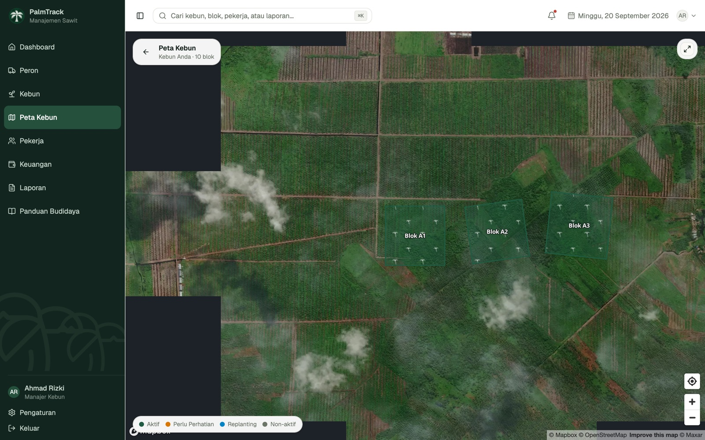
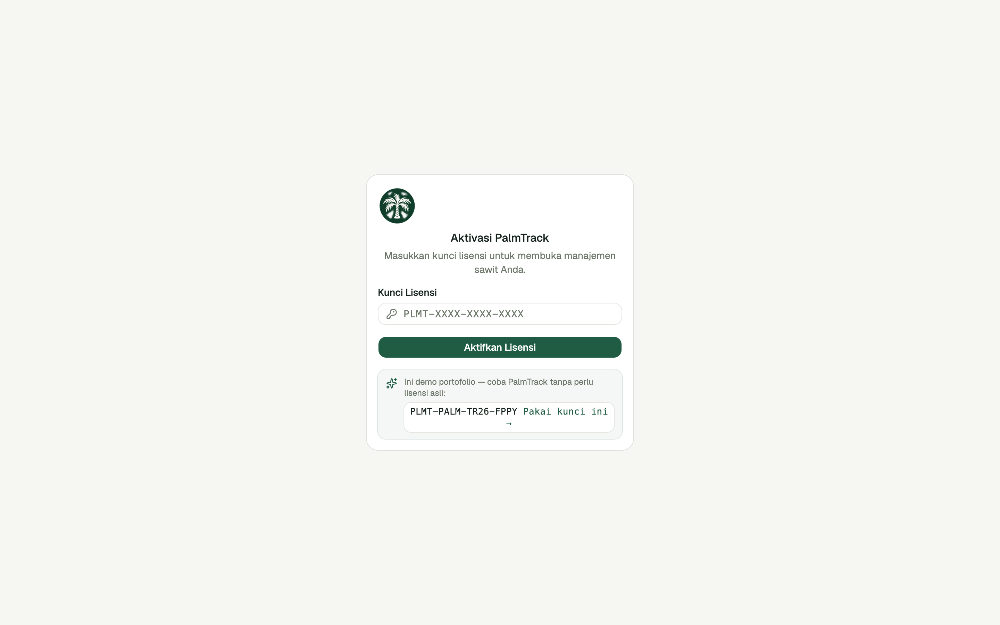
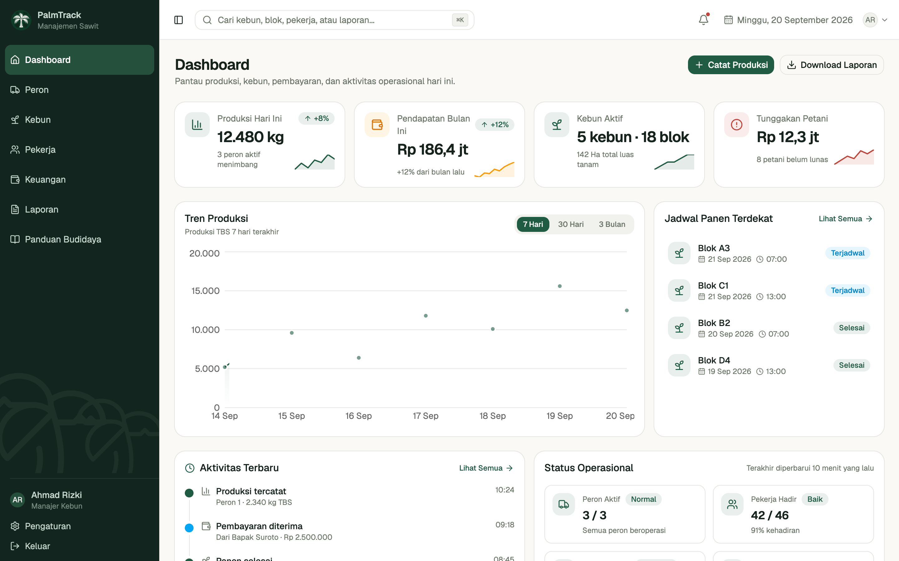
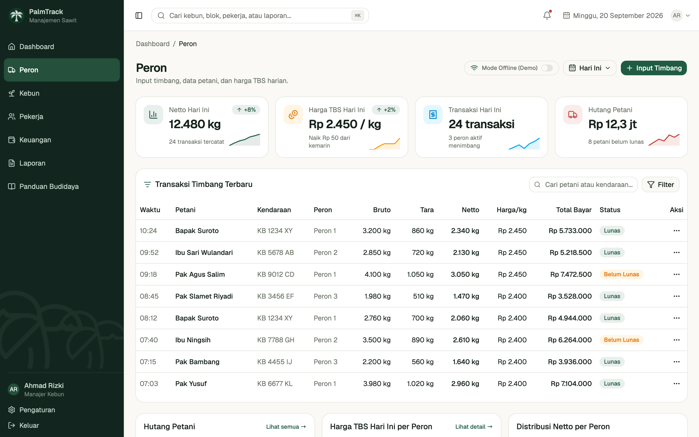
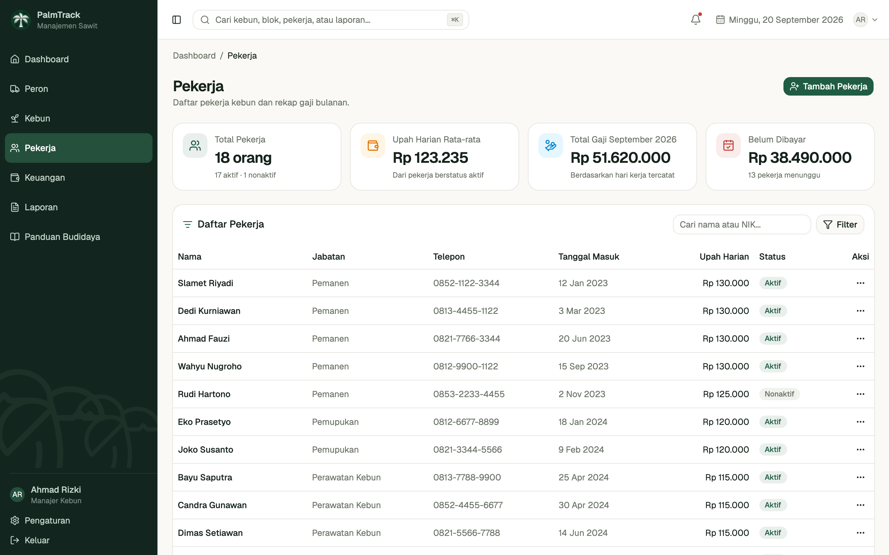
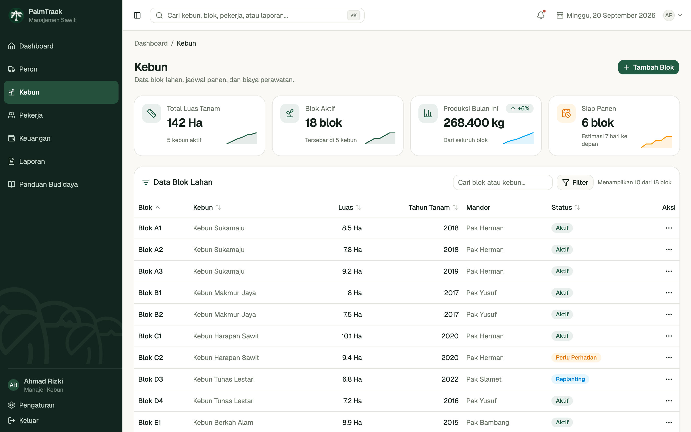
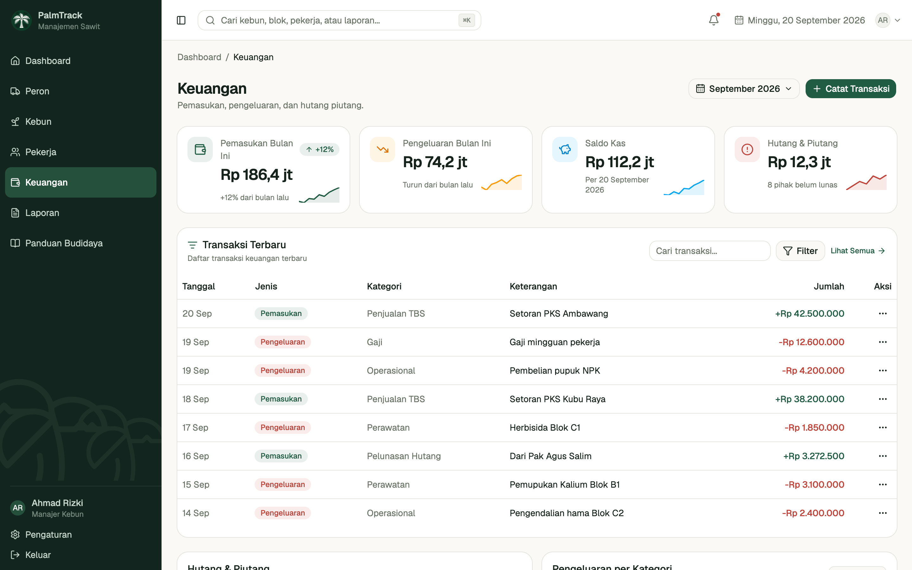
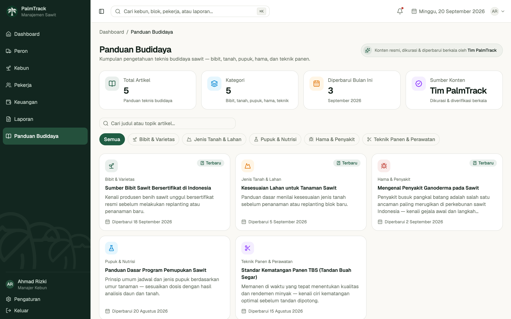
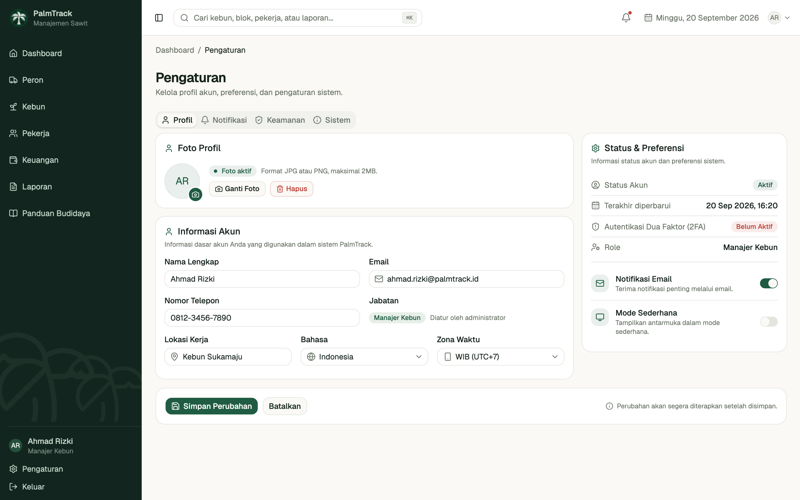

# 🌴 PalmTrack

<p align="center">
  
  
  
</p>

<p align="center">
  <strong>Sistem Manajemen Perkebunan Sawit Terpadu</strong><br/>
  Platform web untuk mengelola peron, kebun, pekerja, dan keuangan usaha sawit skala kampung hingga menengah.
</p>

<p align="center">
  <em>Dari peron ke laporan — semua tercatat, semua terkontrol.</em>
</p>

<p align="center">
  <a href="https://ksatriabintangsamudra.my.id/palmtrack/"><strong>🚀 Lihat Demo Langsung</strong></a>
</p>

> **Catatan demo:** Repositori ini menampilkan progres pengembangan `palmtrack-web` (Phase 1). Saat ini frontend berjalan dengan data contoh (belum terhubung ke backend Laravel sungguhan) untuk keperluan demonstrasi UI/UX dan alur kerja.

---

## 📌 Tentang PalmTrack

PalmTrack adalah sistem manajemen sawit berbasis web yang dirancang khusus untuk **pemilik peron dan kebun sawit** di Indonesia — dari skala kampung hingga menengah. Bukan sistem enterprise yang rumit, tapi cukup pintar untuk menggantikan buku catatan dan Excel berantakan yang selama ini dipakai.

**Siapa penggunanya?**
- 🏭 Pemilik **peron / TPH** (Tempat Pengumpulan Hasil)
- 🌿 Pemilik **kebun sawit** dengan beberapa blok/mandor
- 👷 Manager yang perlu pantau **absensi & gaji pekerja**
- 💰 Bos yang mau lihat **laporan keuangan** kapan saja

---

## ✨ Fitur Utama

### 🏭 Manajemen Peron
- Input timbangan — Bruto → Tare → Netto otomatis
- Data pengirim: nama petani, supir, dan plat truk
- Penetapan harga TBS harian (manual, ikuti harga Disbun setempat)
- Generate nota/kwitansi — cetak langsung atau share via WhatsApp (PDF)
- Pencatatan hutang petani + tracking pelunasan
- Rekap harian & mingguan transaksi peron

### 🌿 Manajemen Kebun
- Data blok/lahan: nama, luas (Ha), tahun tanam, lokasi
- **Peta Kebun** — modul peta tersendiri, tampilan full-bleed layar penuh (dengan toggle fullscreen browser sungguhan): gambar batas lahan tiap blok langsung di atas citra satelit (Mapbox GL), berwarna sesuai status dan bertekstur pola sawit di dalam tiap blok, titik lokasi peron yang bisa diklik untuk lihat data hari ini secara langsung, serta tiap Bos bisa menandai sendiri lokasi kebunnya di peta
- Jadwal panen per blok & tracking realisasi vs rencana
- Input hasil panen: jumlah janjang, estimasi kg, mandor penanggung jawab
- Pencatatan biaya perawatan: pupuk, herbisida, dll per blok

### 👷 Manajemen Pekerja
- Bos menambahkan & mengelola data pekerja secara manual (nama, jabatan, upah harian) — tidak ada login/akun terpisah untuk karyawan
- Rekap hari kerja per periode — cukup kurangi jumlah hari saat pekerja tidak masuk, gaji dihitung otomatis
- Tandai status pembayaran gaji per pekerja (lunas / belum dibayar)

### 🔑 Akses & Lisensi
- Login berbasis kunci lisensi (bukan email/password) — satu aktivasi per perangkat, bukan per-karyawan
- Masa berlaku lisensi otomatis (default 12 bulan) dengan peringatan mendekati kedaluwarsa & alur perpanjangan
- Validasi kunci sepenuhnya di sisi client (format + checksum), tidak memerlukan server lisensi terpisah
- Akun baru (bukan kunci demo) mulai dari **kosong**, bukan data contoh — lewat onboarding singkat (nama usaha + harga TBS awal), lalu setiap modul menampilkan status kosong yang jelas sampai Bos mulai input data sendiri

### 💰 Keuangan Sederhana
- Pemasukan: pencatatan hasil jual TBS ke pabrik / PKS
- Pengeluaran: operasional kebun, peron, gaji, dll
- Hutang & piutang: ke petani plasma, pemasok, atau pihak ketiga
- Laporan bulanan & tahunan — export ke PDF dan Excel

### 📊 Dashboard & Laporan
- Ringkasan produksi harian & bulanan
- Grafik tren harga TBS vs hasil panen per periode
- Notifikasi jadwal panen yang mendekati waktu
- Multi-akun & multi-kebun dalam satu platform

---

## 🔄 Alur Kerja Aplikasi

Gambaran alur data end-to-end, dari lapangan sampai laporan:

1. **Peron** — Operator input timbangan TBS dari petani/pengepul (bruto → tara → netto otomatis, harga harian sudah di-set) — termasuk saat koneksi terputus, lewat mode offline dengan antrian yang otomatis sinkron saat online kembali. Nota digenerate otomatis dan pengingat pembayaran bisa dikirim langsung ke WhatsApp petani.
2. **Kebun** — Mandor mencatat realisasi panen per blok (jumlah janjang, estimasi vs aktual kg) dan biaya perawatan (pupuk, herbisida, dll).
3. **Pekerja** — Bos mengelola daftar pekerja secara manual dan mengisi hari kerja tiap periode (kurangi jika ada yang tidak masuk); gaji dihitung otomatis dan ditandai lunas saat dibayar.
4. **Keuangan** — Pembayaran ke petani (dari peron), gaji pekerja, dan biaya kebun tercatat sebagai pengeluaran; penjualan TBS ke PKS tercatat sebagai pemasukan. Hutang-piutang dipantau sampai lunas, dengan pengingat WhatsApp untuk piutang jatuh tempo.
5. **Laporan & Dashboard** — Semua data di atas diagregasi jadi laporan bulanan/tahunan (PDF/Excel) dan ringkasan real-time di dashboard, sehingga Bos bisa memantau produksi dan keuangan kapan saja tanpa menunggu rekap manual.
6. **Panduan Budidaya** — Modul referensi yang dikurasi dan diperbarui berkala oleh tim PalmTrack (bibit, jenis tanah, pupuk, hama, dll) — bersifat *read-only* untuk semua pengguna SaaS, termasuk Bos/Owner, karena kontennya adalah tanggung jawab tim agronomi PalmTrack, bukan input pelanggan.

---

## 📸 Preview

> Diambil langsung dari `palmtrack-web` yang sedang berjalan — data yang tampil adalah data contoh/dummy (Phase 1, frontend belum tersambung ke backend sungguhan). Belum semua halaman ada di sini; folder [`docs/screenshots/`](docs/screenshots) akan terus bertambah seiring pengembangan.

**Peta Kebun** — denah tiap blok digambar langsung di atas citra satelit sungguhan (Mapbox GL), lengkap dengan pola sawit di dalam setiap blok dan lokasi peron real-time yang bisa diklik:

<p align="center">
  
</p>

<table>
<tr>
<td width="50%"><br/><sub align="center">Aktivasi Lisensi</sub></td>
<td width="50%"><br/><sub align="center">Dashboard</sub></td>
</tr>
<tr>
<td width="50%"><br/><sub align="center">Peron — Input Timbang</sub></td>
<td width="50%"><br/><sub align="center">Pekerja — Gaji &amp; Kehadiran</sub></td>
</tr>
<tr>
<td width="50%"><br/><sub align="center">Kebun</sub></td>
<td width="50%"><br/><sub align="center">Keuangan</sub></td>
</tr>
<tr>
<td width="50%"><br/><sub align="center">Panduan Budidaya</sub></td>
<td width="50%"><br/><sub align="center">Pengaturan — Status Lisensi</sub></td>
</tr>
</table>

---

## 🛠️ Tech Stack

### Frontend — Web Dashboard

| Layer | Teknologi |
|---|---|
| Framework | React 19 + Vite |
| Language | TypeScript |
| Routing | React Router v7 |
| Styling | Tailwind CSS v4 |
| UI Components | shadcn/ui (Base UI) |
| State Management | Zustand |
| Data Fetching | TanStack Query (React Query v5) |
| Charts | Recharts |
| Peta / GIS | Mapbox GL JS + Mapbox GL Draw |
| Form Handling | React Hook Form + Zod |
| PDF Client-side | jsPDF + jspdf-autotable |
| Table | TanStack Table v9 |

> Next.js sempat dipertimbangkan, tapi dilepas karena PalmTrack adalah dashboard internal di balik login (bukan situs publik) — jadi SSR/SEO-nya Next.js tidak terpakai. Vite dipilih karena dev server & build jauh lebih cepat untuk kasus ini, tetap statis dan cocok di-deploy ke Cloudflare Pages.

### Backend — REST API

| Layer | Teknologi |
|---|---|
| Framework | Laravel 12 |
| Language | PHP 8.3 |
| Database | PostgreSQL 16 |
| Authentication | Laravel Sanctum (SPA) |
| PDF Server-side | Barryvdh/Laravel-DomPDF |
| Excel Export | Maatwebsite/Laravel-Excel |
| Queue | Laravel Queue (database driver) |
| File Storage | Local / S3-compatible |

### Infrastructure

| Layer | Teknologi |
|---|---|
| Frontend Hosting | Cloudflare Pages |
| Backend Hosting | VPS (Ubuntu) / Fly.io |
| Database Hosting | Supabase / self-hosted PostgreSQL |
| CDN & DNS | Cloudflare |
| CI/CD | GitHub Actions |
| SSL | Cloudflare (auto) |

---

## 📂 Repository Ini

Repo ini adalah **etalase publik** PalmTrack — dokumentasi, screenshot, dan pipeline deploy ke demo langsung. Source code sungguhan (`palmtrack-web`, dan nantinya `palmtrack-api`) dikelola di repository **private** terpisah, tidak dipublikasikan secara terbuka.

```
palmtrack/
├── .github/workflows/deploy.yml   # CI/CD — tarik source dari repo private, build, deploy ke demo
├── docs/screenshots/              # Screenshot preview aplikasi (lihat bagian Preview)
├── LICENSE
└── readme.md                      # File ini
```

Tertarik lihat/kontribusi ke source code, kerja sama, atau audit teknis? Hubungi lewat kontak di bagian [Tim](#-tim) di bawah.

---

## 🔐 Role & Hak Akses

> **Catatan:** Saat ini `palmtrack-web` adalah aplikasi single-user untuk Bos/Owner, diakses dengan satu kunci lisensi per perangkat — bukan login per-karyawan. Tabel di bawah adalah rencana model hak akses di sisi backend (`palmtrack-api`), untuk kebutuhan masa depan jika Bos ingin menambahkan akun staf terbatas (mis. operator peron atau akuntan).

| Role | Peron | Kebun | Pekerja | Keuangan | Laporan | Pengaturan |
|---|---|---|---|---|---|---|
| **Bos / Owner** | ✅ Full | ✅ Full | ✅ Full | ✅ Full | ✅ Full | ✅ Full |
| **Mandor** | ❌ | ✅ View + Input | ✅ Absensi | ❌ | ❌ | ❌ |
| **Operator Peron** | ✅ Input + Nota | ❌ | ❌ | ❌ | ❌ | ❌ |
| **Akuntan** | ✅ View | ✅ View | ✅ View Gaji | ✅ Full | ✅ Full | ❌ |

---

## 🗺️ Roadmap

### ✅ Frontend — `palmtrack-web` (UI Phase 1 — selesai)
- [x] Setup project React 19 + Vite + shadcn/ui + Tailwind
- [x] Dashboard overview
- [x] Modul Peron — input timbang, data petani, harga TBS, nota, hutang petani
- [x] Modul Kebun — data blok, jadwal & realisasi panen
- [x] Modul Pekerja — data pekerja & rekap gaji bulanan (hari kerja per periode, bukan absensi harian)
- [x] Modul Keuangan — pemasukan, pengeluaran, hutang-piutang
- [x] Modul Laporan
- [x] Modul Panduan Budidaya (read-only, dikurasi tim PalmTrack)
- [x] Modul Pengaturan (profil, notifikasi, keamanan, sistem, status lisensi)
- [x] Login berbasis kunci lisensi (bukan email/password), dengan masa berlaku otomatis
- [x] Akun baru mulai kosong (bukan data contoh) + onboarding singkat + empty state di tiap modul
- [x] Peta Kebun — modul tersendiri full-bleed di atas citra satelit (Mapbox GL): gambar denah/batas lahan per blok, lokasi peron real-time, tiap Bos bisa set lokasi kebunnya sendiri
- [x] Integrasi WhatsApp untuk nota & pengingat pembayaran (deep link `wa.me`, bukan simulasi)
- [x] Mode offline untuk Input Timbang — antrian lokal & auto-sync saat online kembali
- [x] Cetak Nota Timbang & Laporan (Bulanan/Tahunan) sebagai PDF bermerek — bukan placeholder
- [x] Deploy demo ke GitHub Pages

> Semua modul di atas berjalan dengan **data contoh (dummy)** di sisi client — belum ada penyimpanan data sungguhan sampai `palmtrack-api` selesai dibangun dan dihubungkan. Jangan anggap ini sudah production-ready.

### ⏳ Backend — `palmtrack-api` (belum dimulai)
- [ ] Setup project Laravel 12 + PostgreSQL 16
- [ ] Migrasi database — semua tabel utama
- [ ] Authentication & role management (Laravel Sanctum SPA)
- [ ] REST API — Peron, Kebun, Pekerja, Keuangan, Laporan
- [ ] Generate nota/slip gaji PDF sisi server
- [ ] Hubungkan `palmtrack-web` ke API sungguhan (ganti seluruh data dummy)

### 📱 Mobile App — Flutter (rencana jangka panjang)
- [ ] Flutter Android app (offline-first, SQLite)
- [ ] Bluetooth thermal printer (nota timbang)
- [ ] Background sync offline → online
- [ ] Push notification (jadwal panen, gaji)

---

## 🤝 Tim

| Nama | Role |
|---|---|
| [Ksatria Bintang Samudra](https://ksatriabintangsamudra.my.id) | Founder & Lead Developer |

---

## 📜 Lisensi

Copyright © 2026 Ksatria Bintang Samudra. All rights reserved.

Proyek ini bersifat proprietary dan tidak untuk distribusi terbuka tanpa izin tertulis dari pemilik.

---

<p align="center">
  🌴 Dibangun untuk para petani & pemilik sawit Indonesia<br/>
  <a href="https://palmtrack.id">palmtrack.id</a> · Pontianak, Kalimantan Barat
</p>
